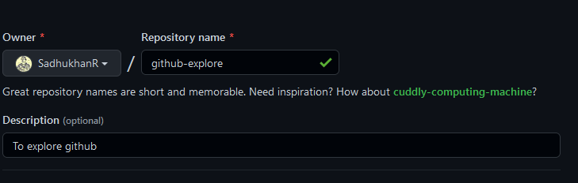
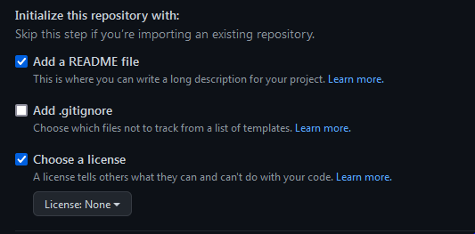
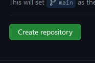

# Make Your Github Repo
Let's make your own Repo
### New 
Click on New
<h6 align="center"></h6>
### Choose Repository Name
Give a Cool Name for example here I use *'github-explore'*
<h6 align="center"></h6>
### Make it 
Make it Public or private or as you wish
<h6 align="center"></h6>
### Initialize
If you want you add a README.md or .gitignore
<h6 align="center"></h6>
### Create
Click on Create. Well Done you made your first Repository!
<h6 align="center"></h6>
