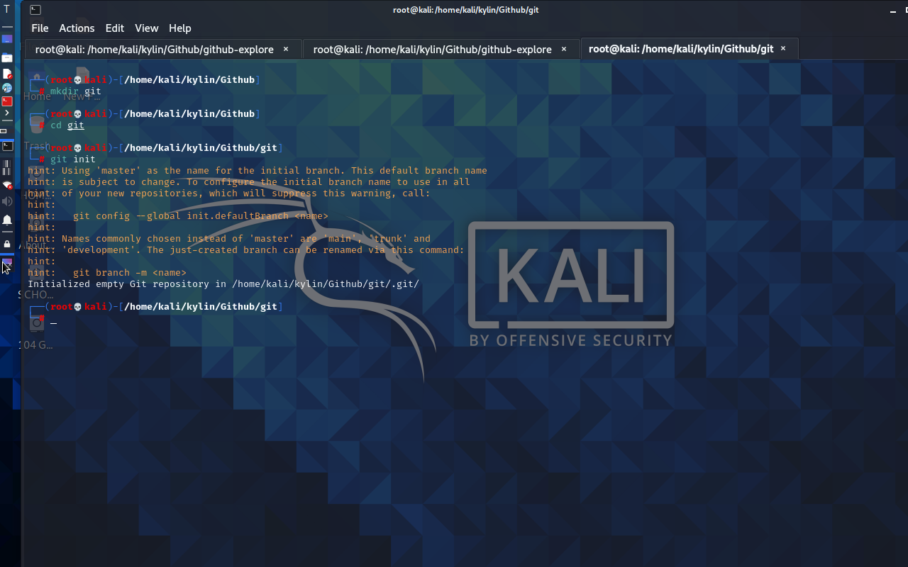
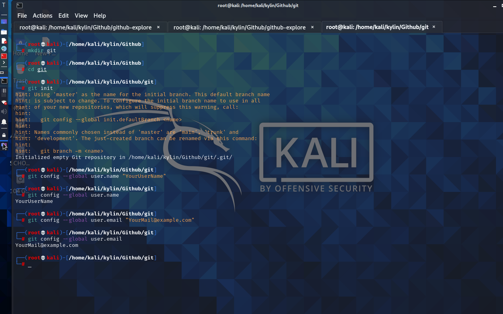

# What is Git
Git is one of famous Version Control System.
As the name implies, Version Control is about the management
of multiple versions of a project. To manage a version,
each change (addition, edition, or removal etc) to the files in
a project must be tracked. Version Control records each change
made to a file (or a group of files) and offers a way to undo
each change.
One of the most important advantages of using Version Control is teamwork.
When more than one person is contributing to a project, tracking changes
becomes very important because, it greatly increases the probability
of overwriting another person’s changes.
With Version Control, multiple people can work on their copy of
the project (called branches) and only merge those changes to the
main project when they (or the other team members) are satisfied with the work.
## What is Github
Brefly Github is a remote repo of your local version control
system ( Git )
## Git Project Management System Setup
  1. First You need to download and install [Git]() on your PC
  2. You Need to create an account on [Github](https://github.com)
  3. After open Git on powershell for Windows , bash shell for
    Linux.
  4. Add your user name (Github Username) in Git

        git config --global user.name "YourUsername"

  5. Add your user emali (Github Email) in Git

        git config --global user.mail "YourMail"

  6. If you want an extra protection on Github 
     then add a [SSH Key](ssh-key.md).
## Linking Local and Server:
If you have a Repository on Github ( Let this repo )
and you want to make it as a Git local repository
over any server
### Https

        git clone https://github.com/Username/RepoName
Here

        git clone https://github.com/SudipC3/github-explore.git
### SSH 
       
        git clone git@github.com:SudipC3/github-explore.git

       
## Git Commands
Here some common git commands you should know
### Initialize a new Git database

     git init

  
### Adding username and email
First you need to create an account on
[Github](https://github.com)

To add your username 

     git config --global user.name "YourUserName"

To add your email

     git config --global user.mail "YourMail@example.com"

